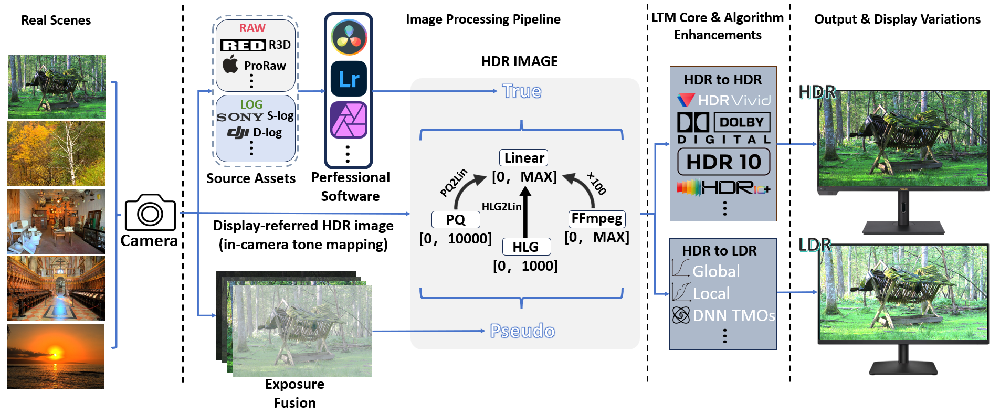

# High Dynamic Range Imaging & Tone Mapping: A Survey

> **[A Survey on High Dynamic Range Imaging and Tone Mapping Operators](https://arxiv.org/your-paper-link)**
>
> *1Your Lab/University Name, 2Co-author Affiliation*

**⚡We will actively maintain this repository and incorporate new research as it emerges. If you have any questions, please contact [your_email@domain.com]. Welcome to collaborate on academic research and writing papers together.**

## 📌 What is This Project About?

    

High Dynamic Range (HDR) imaging is essential for capturing and reproducing the vast range of luminosity found in real-world scenes. As display technologies and capture devices evolve, the pipeline from **Real Scenes** to final **Display Variations** has become increasingly complex.

This repository (and associated survey) aims to provide a comprehensive roadmap of the HDR imaging pipeline, with a specific focus on:

1.  **Source Acquisition:** Processing pipelines for RAW/Log data and Multi-exposure Fusion techniques.
2.  **Image Processing Pipeline:** The transformation from linear light to perceptual quantizers (PQ/HLG) and standard formats.
3.  **Tone Mapping Operators (TMOs):** A deep dive into the "LTM Core," covering the critical transition from HDR to LDR displays. We categorize methods into:
    * 📈 **Global TMOs**
    * 🖼️ **Local TMOs**
    * 🧠 **Deep Neural Network (DNN) TMOs**
4.  **Display Adaptation:** Strategies for HDR-to-HDR (e.g., HDR10, Dolby Vision) and HDR-to-LDR rendering.

Our key goal is to organize the state-of-the-art methods in tone mapping and value the evaluation of visual quality in the HDR domain.
