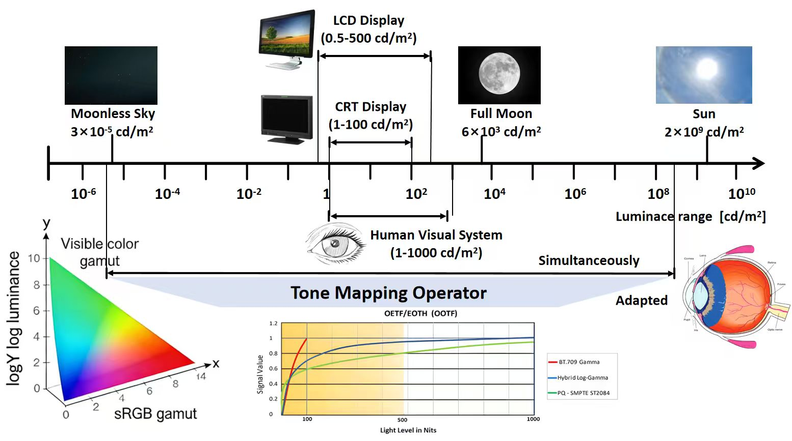
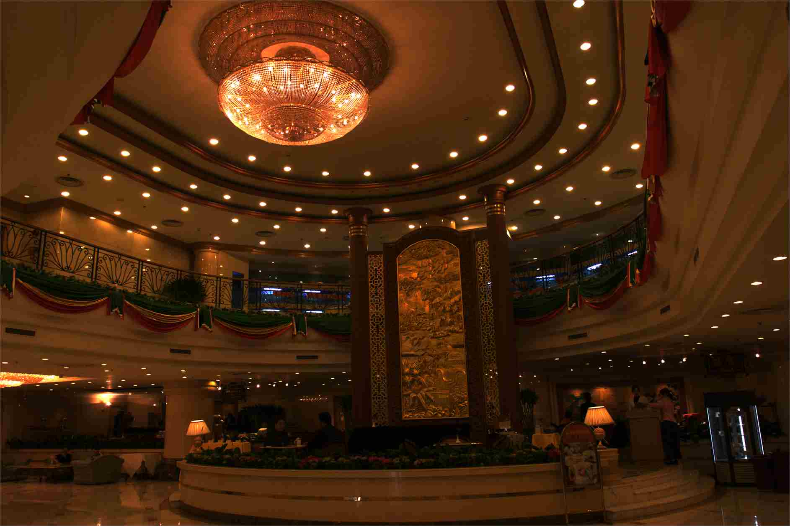
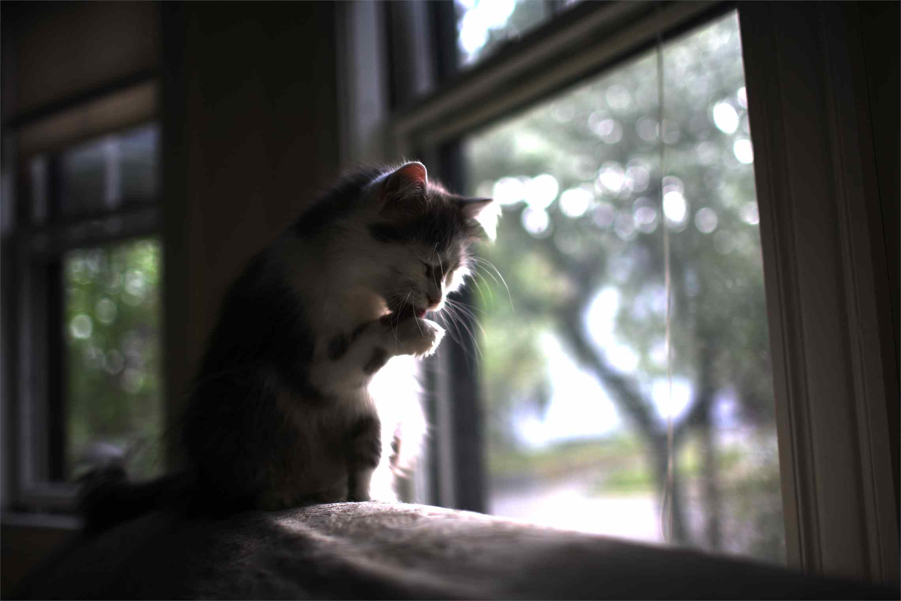
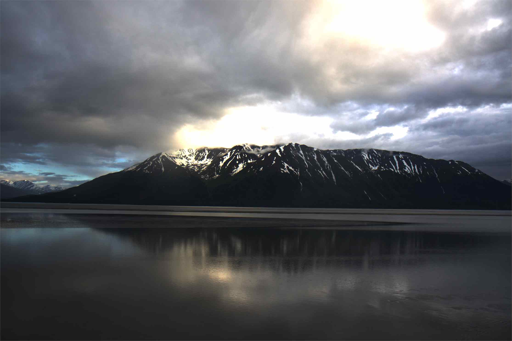
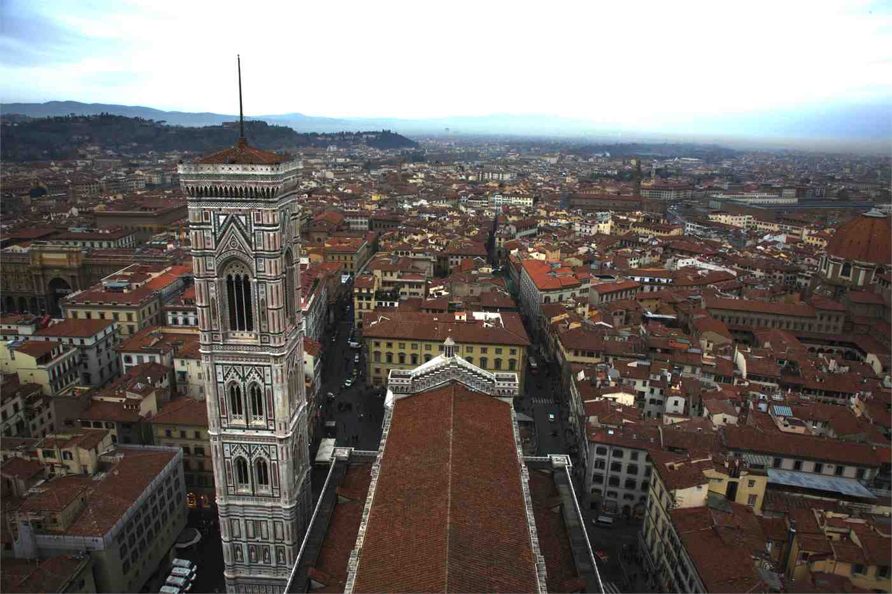
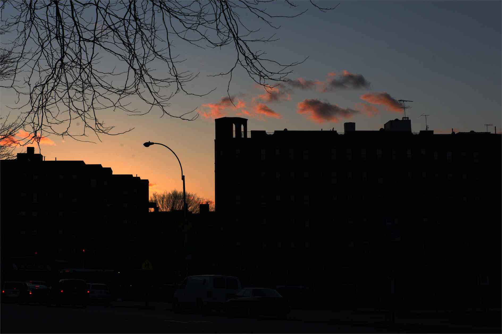

# 🌟 A Comprehensive Survey on High Dynamic Range Tone Mapping: From Acquisition to Evaluation

**Jiebin Yan,Qiulin Zeng,Ming Yu,Xiaolv Xu,Yaohua Zha,Xuelin Liu,Yuming Fang**

**⚡ We will actively maintain this repository and incorporate new research as it emerges. Welcome to collaborate on academic research and writing papers together!**

 

## 📌 What is This Survey About?

    

> **Figure 1: The Physical Basis of HDR.**
> The real world exhibits a vast dynamic range of luminance, from starlight (**10⁻⁶ cd/m²**) to sunlight (**10⁹ cd/m²**). However, standard displays (CRT/LCD) cover a much narrower range. **Tone Mapping Operators (TMOs)** serve as the critical bridge, mimicking the human visual system's adaptive capabilities to compress this wide dynamic range into the visible gamut of display devices. *(Inspired by a presentation by Rafał Mantiuk)*

With the steady advancement of photographic technologies and the continuous improvement of display devices, modern image sensors are now capable of capturing scenes with higher dynamic ranges (HDR) and richer illumination details. Traditional image sensors typically provide only 8–10 bits of quantization precision, which is insufficient. In contrast, contemporary high-performance CMOS and CCD sensors commonly achieve 12–16 bits. However, most existing display devices can only offer a much narrower dynamic range. Therefore, how to faithfully present the visual information contained in HDR images on low dynamic range (LDR) displays has become a prominent research topic.

    

> **Figure 2: The Modern HDR Processing Pipeline.** > **(1) Acquisition:** Raw HDR images are captured via professional cameras or multi-exposure fusion. **(2) Processing:** Physical luminance is converted to digital luminance using transfer functions (PQ/HLG). **(3) LTM Core:** The central tone mapping stage compresses HDR images. **(4) Display:** Tone-mapped images are shown in HDR or LDR displays.

To reproduce luminance and detail faithfully, TMOs compress the dynamic range while preserving perceptually important visual features. 
* **Global TMOs**: Simple and efficient, but struggle to balance global brightness and local contrast.
* **Local TMOs**: Enhance details based on neighborhood variations, but face challenges with computational complexity and edge artifacts.
* **Deep Learning TMOs**: End-to-end optimization capturing complex nonlinear mappings for better luminance, contrast, and color perception.

### ✨ Major Contributions of This Survey
Due to the diversity of HDR data formats, standards, and displays, understanding the entire pipeline can be challenging. To address the gap left by older surveys, our major contributions are:
1. **Dataset Overview:** A comprehensive review of existing HDR datasets, focusing on format encodings, standards, display pipelines, and challenges.
2. **Systematic Categorization:** A structured analysis of methodological characteristics of existing HDR TMOs.
3. **Comparative Evaluation:** Quantitative results and qualitative analyses of various TMOs.

---

## 📂 HDR Dataset Summary

| Dataset | Year | Images | Encoding | Resolution | Public Availability |
| :--- | :---: | :---: | :---: | :---: | :--- |
| **HDR-gallery** | 2007 | 8 | ffmpeg-linear | 1536×2048 | [Link](https://pfstools.sourceforge.net/hdr_gallery.html) |
| **Funt** | 2010 | 112 | ffmpeg-linear | 1421×2141 | [Link](https://www.cs.sfu.ca/~colour/data/funt_hdr/) |
| **MIT fiveK** | 2011 | 5000 | PQ | 3000×4000 | [Link](https://data.csail.mit.edu/graphics/fivek/) |
| **Narwaria** | 2013 | 10 | Linear | 1080×1920 | [Link](https://www.repository.cam.ac.uk/items/c2d00e29-07b5-4b67-bcfc-80893b17fa53) |
| **Korshunov** | 2015 | 20 | Linear | 1080×944 | [Link](https://www.repository.cam.ac.uk/items/c2d00e29-07b5-4b67-bcfc-80893b17fa53) |
| **HDR-Eye** | 2015 | 46 | Linear | 512×512 | [Link](https://www.epfl.ch/labs/mmspg/downloads/hdr-eye/) |
| **SJTU-HDR** | 2016 | 16 | PQ | 2160×3840 | [Link](https://medialab.sjtu.edu.cn/files/SJTU%20HDR%20Video%20Sequences/demo_images/) |
| **HDRC** | 2024 | 80 | ffmpeg-linear | 1080×1920 | [Link](https://github.com/Yliu724/HDRC) |
| **HDRQAD** | 2025 | 147 | ffmpeg-linear | 1080×944 | - |
| **HDRT** | 2025 | 10000 | Linear | 5120×3840 | [Link](https://huggingface.co/datasets/jingchao-peng/HDRTDataset) |

---

## 📸 Dataset Sample Images

  <table>
    <tr>
      <td></td>
      <td></td>
      <td></td>
      <td></td>
      <td></td>
    </tr>
    <tr>
      <td></td>
      <td></td>
      <td></td>
      <td></td>
      <td></td>
    </tr>
  </table>
  
<em>Ten representative examples from the 1,000-image HDR dataset constructed in this study. For visualization in the manuscript, the HDR images are displayed after Gamma correction, as native PQ-encoded HDR content cannot be faithfully presented on conventional SDR media.</em>

---

## 📊 Quantitative Comparison

Comparison of tone-mapping methods using TMQI, TMQI-Ⅱ, and NLPD metrics.

| Method               | TMQI ↑  | S1     | N1     | TMQI-II ↑ | S2     | N2     | NLPD ↓  |
|----------------------|---------|--------|--------|------------------|--------|--------|---------|
| Gamma                | 0.7688  | 0.7618 | 0.1194 | 0.4029           | 0.5971 | 0.2088 | 0.1257  |
| Logarithmic          | 0.7782  | 0.7102 | 0.2188 | 0.3564           | 0.6700 | 0.0429 | 0.1742  |
| Exponential          | 0.8445  | 0.8081 | 0.3903 | 0.8318           | 0.7808 | 0.8829 | 0.1430  |
| BestExp (Hist)       | 0.8392  | 0.8178 | 0.3533 | 0.6723           | 0.7286 | 0.6161 | 0.1355  |
| BestExp (Mean)       | 0.8039  | 0.8043 | 0.2063 | 0.5249           | 0.6702 | 0.3796 | 0.1263  |
| WardHistAdj          | 0.8827  | 0.8283 | 0.5612 | 0.6887           | 0.7773 | 0.6002 | 0.1621  |
| Ashikhmin            | 0.8395  | 0.7821 | 0.4014 | 0.4585           | 0.8365 | 0.0804 | 0.1637  |
| Drago03              | 0.8388  | 0.7810 | 0.4050 | 0.7732           | 0.7872 | 0.7592 | 0.1549  |
| Reinhard (Global)    | 0.8474  | 0.7759 | 0.4548 | 0.6569           | 0.7904 | 0.5234 | 0.1587  |
| Reinhard (Local)     | 0.8865  | 0.8361 | 0.5669 | 0.7041           | 0.8298 | 0.5783 | 0.1486  |
| Reinhard-Devlin      | 0.7525  | 0.7239 | 0.0953 | 0.3437           | 0.6037 | 0.0837 | 0.1523  |
| Lischinski           | 0.8810  | 0.8497 | 0.5193 | 0.8131           | 0.8242 | 0.8020 | 0.1447  |
| Kim-KautzConsistent  | 0.8262  | 0.7976 | 0.3118 | 0.5950           | 0.7878 | 0.4023 | 0.1575  |
| Raman                | 0.7655  | 0.7336 | 0.1327 | 0.3665           | 0.6419 | 0.0911 | 0.1757  |
| Shibata              | 0.8645  | 0.7872 | 0.5247 | 0.5046           | 0.7463 | 0.2630 | 0.1679  |
| DRLTM                | 0.8596  | 0.7378 | 0.5856 | 0.3822           | 0.7003 | 0.0641 | 0.1728  |
| Le21                 | 0.8333  | 0.8174 | 0.2933 | 0.4488           | 0.6735 | 0.2240 | 0.1538  |
| TMO-GAN              | 0.8246  | 0.8272 | 0.2687 | 0.5457           | 0.7611 | 0.3304 | 0.1421  |
| G-SemTMO             | 0.6992  | 0.6442 | 0.0132 | 0.2493           | 0.4788 | 0.0199 | 0.1247  |
| UnCLTMO              | 0.8791  | 0.8419 | 0.5189 | 0.5877           | 0.8040 | 0.3715 | 0.1580  |
| Unpaired-TMO         | 0.8772  | 0.8088 | 0.5618 | 0.6351           | 0.7849 | 0.4854 | 0.1620  |
| ZSDH                 | 0.7547  | 0.6376 | 0.1937 | 0.3271           | 0.6082 | 0.0459 | 0.1831  |
| PS-TMO               | 0.8721  | 0.8045 | 0.5265 | 0.4682           | 0.6463 | 0.2901 | 0.1625  |

---

## 📚 Relevant Methodological Literature

<b>1. Traditional & Optimization-based Methods (Click to Expand)</b>

 

1. **WardHistAdj:** "A Visibility Matching Tone Reproduction Operator for High Dynamic Range Scenes". *IEEE TVCG 1997*. [[Paper](https://ieeexplore.ieee.org/document/646233)]
2. **Ashikhmin:** "A Tone Mapping Algorithm for High Contrast Images". *EGWR 2002*. [[Paper](https://dl.acm.org/doi/10.5555/581896.581916)]
3. **Reinhard:** "Photographic Tone Reproduction for Digital Images". *SIGGRAPH 2002*. [[Paper](https://dl.acm.org/doi/10.1145/566654.566575)]
4. **Drago:** "Adaptive Logarithmic Mapping For Displaying High Contrast Scenes". *Eurographics 2003*. [[Paper](https://resources.mpi-inf.mpg.de/tmo/logmap/logmap.pdf)]
5. **ReinhardDevlin:** "Dynamic Range Reduction Inspired by Photoreceptor Physiology". *IEEE TVCG 2005*. [[Paper](https://cs.ucf.edu/~ceh/Publications/Papers/Rendering/IEEETVCG04ReinhardDevlin.pdf)]
6. **Lischinski:** "iCAM06: A refined image appearance model for HDR image rendering". *JVCIR 2007*. [[Paper](https://dl.acm.org/doi/10.1016/j.jvcir.2007.06.003)]
7. **KimKautzConsistent:** "Consistent Tone Reproduction". *IASTED CGIM 2008*. [[Paper](https://vclab.kaist.ac.kr/cgim2008/MHKim_JKautz_CGIM2008s.pdf)]
8. **Raman:** "Bilateral Filter Based Compositing for Variable Exposure Photography". *Eurographics 2009*. [[Paper](http://andrewd.ces.clemson.edu/courses/cpsc482/papers/RC09_bilateralFilterCompositing.pdf)]
9. **Windowed:** "Globally Optimized Linear Windowed Tone-Mapping". *IEEE TVCG 2010*. [[Paper](https://grail.cs.washington.edu/projects/sq_tonemapping/tonemapping_tvcg.pdf)]
10. **Optimized:** "Optimizing a Tone Curve for Backward-Compatible HDR Image and Video Compression". *IEEE TIP 2011*. [[Paper](https://www.cl.cam.ac.uk/~rkm38/pdfs/mai11otc.pdf)]
11. **Gradient-Domain:** "Gradient-Domain Image Reconstruction Framework with Intensity-Range and Base-Structure Constraints". *CVPR 2016*. [[Paper](https://openaccess.thecvf.com/content_cvpr_2016/papers/Shibata_Gradient-Domain_Image_Reconstruction_CVPR_2016_paper.pdf)]
12. **Krawczyk:** "Perceptual Lightness Modeling for High-Dynamic-Range Imaging". *ACM TAP 2017*. [[Paper](https://dl.acm.org/doi/epdf/10.1145/3086577)]
13. **Hybrid-l1-l0:** "A Hybrid l1-l0 Layer Decomposition Model for Tone Mapping". *CVPR 2018*. [[Paper](https://openaccess.thecvf.com/content_cvpr_2018/papers/Liang_A_Hybrid_l1-l0_CVPR_2018_paper.pdf)]
14. **Multi-Scale-Hist:** "Tone Mapping Based on Multi-scale Histogram Synthesis". *arXiv 2021*. [[Paper](https://arxiv.org/abs/2102.00408)]
15. **Perceptually Adaptive:** "Perceptually Adaptive Real-Time Tone Mapping". *SIGGRAPH Asia 2023*. [[Paper](https://dl.acm.org/doi/abs/10.1145/3610548.3618222)]

<b>2. Deep Learning-based Methods (Click to Expand)</b>

 

1. **DeepTMO:** "Deep Tone Mapping Operator for High Dynamic Range Images". *IEEE Access 2019*. [[Paper](https://arxiv.org/abs/1908.04197)]
2. **TMNet:** "Deep tone mapping network in HSV color space". *IEEE Access 2019*. [[Paper](https://ieeexplore.ieee.org/abstract/document/8965992)]
3. **TMO-Net:** "TMO-Net: A Parameter-Free Tone Mapping Operator Using Generative Adversarial Network". *IEEE Access 2021*. [[Paper](https://ieeexplore.ieee.org/document/9371686)]
4. **Deep Laplacian:** "Perceptually Optimized Deep High-Dynamic-Range Image Tone Mapping". *arXiv 2021*. [[Paper](https://arxiv.org/abs/2109.00180)]
5. **Deep Reformulated Laplacian:** "Deep Reformulated Laplacian Tone Mapping". *arXiv 2021*. [[Paper](https://arxiv.org/abs/2102.00348)]
6. **Unpaired-TMO:** "Unpaired Learning for High Dynamic Range Image Tone Mapping". *ICCV 2021*. [[Paper](https://openaccess.thecvf.com/content/ICCV2021/papers/Vinker_Unpaired_Learning_for_High_Dynamic_Range_Image_Tone_Mapping_ICCV_2021_paper.pdf)]
7. **PS-TMO:** "A Perceptually Optimized and Self-Calibrated Tone Mapping Operator". *IEEE TMM 2023*. [[Paper](https://ieeexplore.ieee.org/document/10982125)]
8. **IVTMNet:** "Unsupervised HDR Image and Video Tone Mapping via Contrastive Learning". *arXiv 2023*. [[Paper](https://arxiv.org/abs/2303.07327)]
9. **TMO-GAN:** "A Generative Adversarial Network Based Tone Mapping Operator for 4K HDR Images". *ICNC 2023*. [[Paper](https://ieeexplore.ieee.org/document/10074176)]
10. **G-SemTMO:** "G-SemTMO: Tone Mapping with a Trainable Semantic Graph". *arXiv 2024*. [[Paper](https://arxiv.org/abs/2208.14113)]
11. **DPRNet:** "Learning Differential Pyramid Representation for Tone Mapping". *AAAI 2024*. [[Paper](https://arxiv.org/abs/2412.01463)]

<b>3. Image Quality Assessment Methods (Click to Expand)</b>

 

1. **NLPD:** "Perceptually Optimized Image Rendering". *JOSA A 2017*. [[Paper](https://arxiv.org/pdf/1701.06641)]
2. **TMQI:** "Objective Quality Assessment of Tone-Mapped Images". *IEEE TIP 2013*. [[Paper](https://ece.uwaterloo.ca/~z70wang/research/tmqi/TIP_TMQI.pdf)]
3. **TMQI-II:** "High Dynamic Range Image Compression by Optimizing Tone Mapped Image Quality Index". *IEEE TIP 2015*. [[Paper](https://ece.uwaterloo.ca/~z70wang/publications/TIP_TMO.pdf)]

---

## 💝 Acknowledgement

We sincerely thank the creators and maintainers of the following public datasets: 
[HDR-gallery](https://pfstools.sourceforge.net/hdr_gallery.html) | [Funt](https://www.cs.sfu.ca/~colour/data/funt_hdr/) | [MIT fiveK](https://data.csail.mit.edu/graphics/fivek/) | [Narwaria](https://www.repository.cam.ac.uk/items/c2d00e29-07b5-4b67-bcfc-80893b17fa53) | [Korshunov](https://www.repository.cam.ac.uk/items/c2d00e29-07b5-4b67-bcfc-80893b17fa53) | [HDR-Eye](https://www.epfl.ch/labs/mmspg/downloads/hdr-eye/) | [SJTU-HDR](https://medialab.sjtu.edu.cn/files/SJTU%20HDR%20Video%20Sequences/demo_images/) | [HDRC](https://github.com/Yliu724/HDRC) | [HDRT](https://huggingface.co/datasets/jingchao-peng/HDRTDataset)

## 📧 Contact

If you have any questions or are interested in collaboration, please feel free to reach out:

