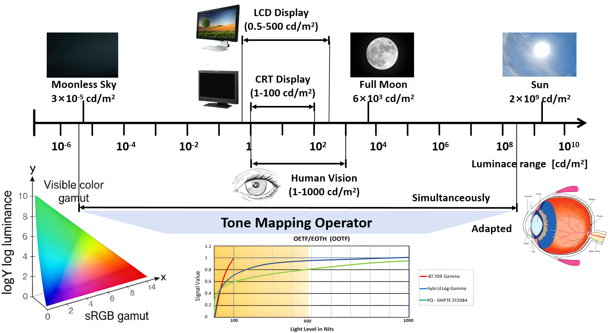
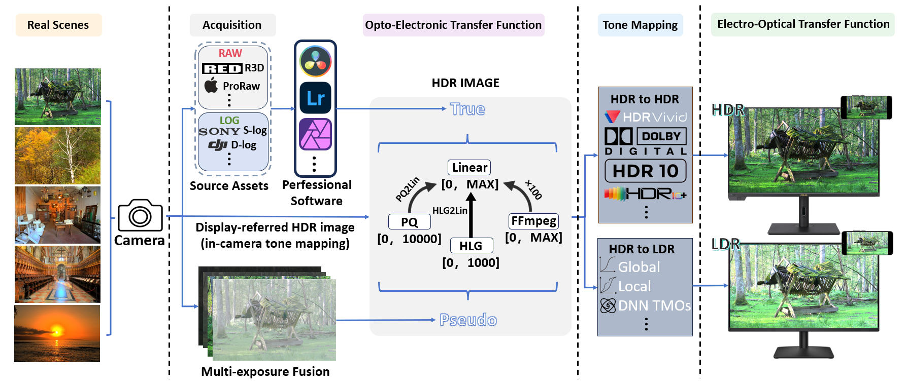
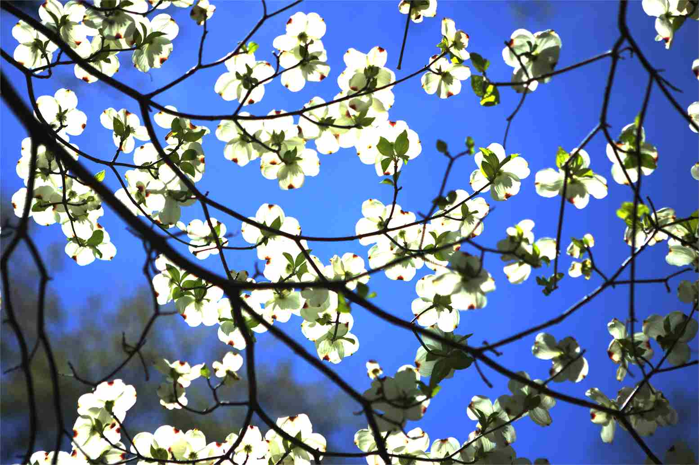
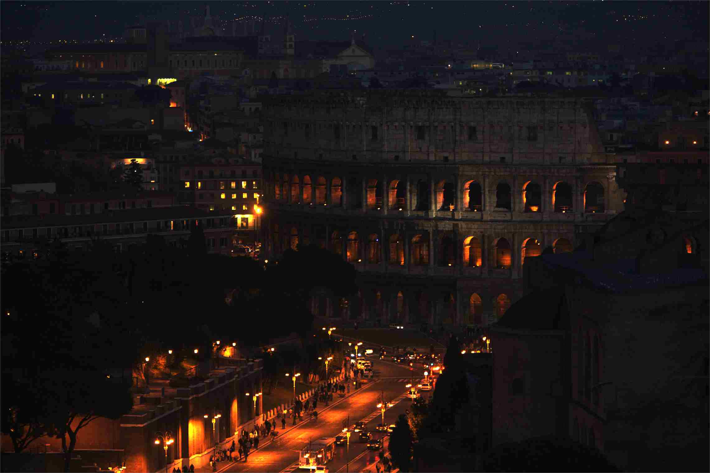
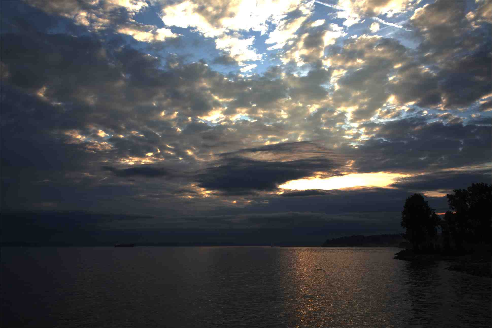
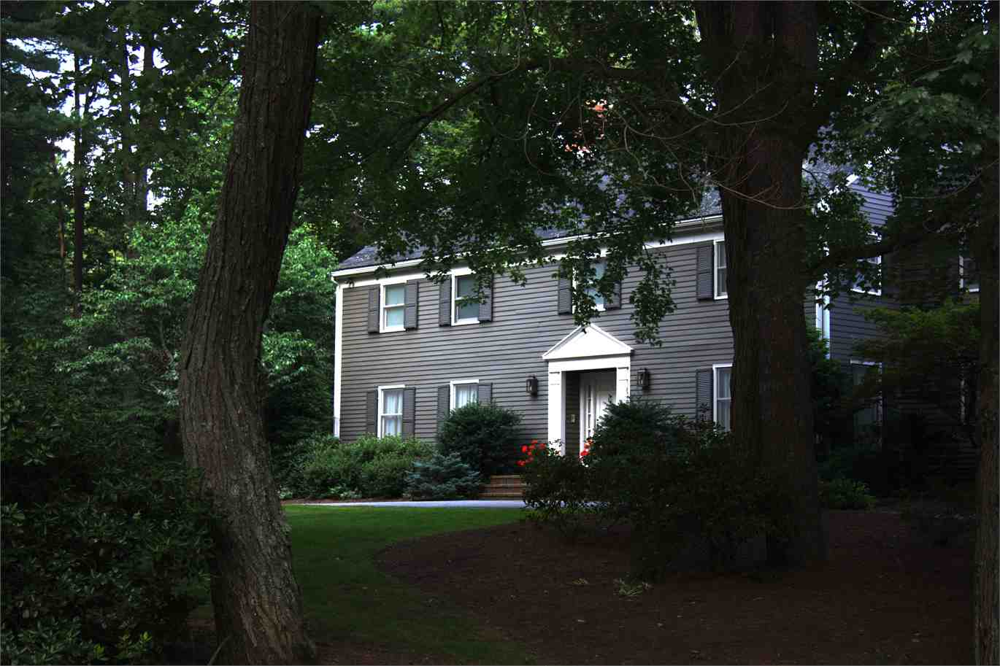

# A Comprehensive Survey on High Dynamic RangeTone Mapping: From Acquisition to Evaluation

> **[A Survey on High Dynamic Range Imaging and Tone Mapping Operators]**
>
> 1Yan Lab, 2JIANGXI UNIVERSITY OF FINANCE AND ECONOMICS

**⚡We will actively maintain this repository and incorporate new research as it emerges. If you have any questions, please contact [qiulinzeng0722@163.com]，[yuming03133@163.com]，[3198186694@qq.com]. Welcome to collaborate on academic research and writing papers together.**

## 📌 What is This Survey About?

    

    <b>Figure 1: The Physical Basis of HDR.</b>  
    The real world exhibits a vast dynamic range of luminance, from starlight ($10^{-6} cd/m^2$) to sunlight ($10^{9} cd/m^2$). However, standard displays (CRT/LCD) cover a much narrower range. <b>Tone Mapping Operators (TMOs)</b> serve as the critical bridge, mimicking the human visual system's adaptive capabilities to compress this wide dynamic range into the visible gamut of display devices.Inspired by a presentation by Rafał Mantiuk, available online: https://www.cl.cam.ac.uk/~rkm38/pdfs/tone_mapping.pdf

 

With the steady advancement of photographic technologies and the continuous improvement of display devices, modern image sensors are now capable of capturing scenes with higher dynamic ranges (HDRs) and richer illumination details. Traditional image sensors typically provide only 8–10 bits of quantization precision, which is insufficient to fully record information in both bright highlights and dark regions. In contrast, contemporary high-performance CMOS and CCD sensors commonly achieve quantization precisions of 12–16 bits. However, most existing display devices, including monitors, projectors, head-mounted omnidirectional displays, and printers, can only offer a much narrower dynamic range than image sensors. As a result, HDR images cannot be displayed directly on these devices. Therefore, how to faithfully present the visual information contained in HDR images on low dynamic range (LDR) displays has become a prominent research topic in the image processing community.

    

    <b>Figure 2: The Modern HDR Processing Pipeline.</b>  
    An overview of HDR image processing pipeline. (1) Acquisition: the raw HDR images (Raw or Log format) are usually captured via professional cameras or the so-called multi-exposure fusion methods. (2) Processing: physical luminance is then converted to digital luminance using a transfer function such as PQ and HLG. (3) LTM Core: the central tone mapping stage which compresses HDR images to various dynamic ranges. (4) Various Dynamic Range Displays: the tone-mapped HDR images are shown in HDR (e.g., HDR10 and Dolby Vision) or LDR displays.

 

As illustrated in Fig. 2, there exist significant disparities in the dynamic range from real-world scenes to various imaging and display devices. The luminance of natural scenes spans approximately from 3×10⁻⁵ to 2 × 10⁹ cd/m², corresponding to a dynamic range on the order of 10¹⁵. The human vision can perceive luminance levels ranging from approximately 10⁻⁶ to 10⁶ cd/m², while typical viewing conditions are usually within 1–10³ cd/m². The instantaneous dynamic range of human vision is about 10²–10³, which can extend to 10¹²–10¹⁴ through visual adaptation mechanisms. Modern image sensors are capable of capturing a dynamic range on the order of 10⁴–10⁵. In contrast, conventional LDR displays typically support only 10²–10³ dynamic range, which is substantially narrower than that of human vision.

To reproduce the luminance and detail information of HDR images as faithfully as possible on LDR display devices, TMOs are adopted to compress the dynamic range of HDR images while preserving perceptually important visual features for human vision, enabling HDR content to be adapted to the luminance constraints of display devices. In early studies, TMOs relied mainly on global tone reproduction curves, where a uniform nonlinear mapping function is applied to the entire image. Such methods are structurally simple and computationally efficient but often struggle to simultaneously balance global brightness consistency and local contrast preservation. Subsequently, local TMOs were proposed taking into account neighborhood luminance variations and visual adaptation. These local TMOs significantly enhance detail reproduction in both highlight and shadow regions, leading to more perceptually natural results. Nevertheless, local TMOs are computationally more complex, and achieving a favorable trade-off between avoiding edge artifacts and preserving local contrast remains a challenging problem. More recently, many deep learning–based TMOs have been proposed. Compared with traditional approaches, this type of method can learn complex nonlinear mappings by end-to-end optimization of the HDR-to-LDR mapping process from large-scale data, thus better capturing the perception of luminance, contrast, and color.

Due to the diversity of HDR data formats, industrial standards, and dynamic range displays, as well as the fast growing development of HDR tone mapping techniques, it is very hard for us to have a clear holistic understanding about HDR tone mapping. Fortunately, Eilertsen and Han present two comprehensive reviews of TMOs, mapping the entire domain. However, the first study was conducted about ten years ago, and the second study lacks a clear description of the complete pipeline of HDR tone mapping. To address this gap and inspired by these surveys about visual quality assessment, this survey presents a comprehensive review of HDR tone mapping, and the major contributions can be summarized as follows: (Ⅰ) we provide a comprehensive overview of existing HDR datasets, with a particular focus on their format encodings, standards, display pipelines, and associated challenges; (Ⅱ) we systematically review and categorize existing HDR TMOs, offering a structured and comprehensive analysis of their methodological characteristics; (Ⅲ) we conduct a comparative evaluation of TMOs and present quantitative results and qualitative analyzes.

## :file_folder:HDR Dataset Summary

| Dataset | Years | Images | Encoding | Resolution | Public availability |
| :--- | :---: | :---: | :---: | :---: | :--- |
| **HDR-gallery** | 2007 | 8 | ffmpeg-linear | 1536×2048 | [Link](https://pfstools.sourceforge.net/hdr_gallery.html) |
| **Funt** | 2010 | 112 | ffmpeg-linear | 1421×2141 | [Link](https://www.cs.sfu.ca/~colour/data/funt_hdr/) |
| **MIT fiveK** | 2011 | 5000 | PQ | 3000×4000 | [Link](https://data.csail.mit.edu/graphics/fivek/) |
| **Narwaria** | 2013 | 10 | Linear | 1080×1920 | [Link](https://www.repository.cam.ac.uk/items/c2d00e29-07b5-4b67-bcfc-80893b17fa53) |
| **Korshunov** | 2015 | 20 | Linear | 1080×944 | [Link](https://www.repository.cam.ac.uk/items/c2d00e29-07b5-4b67-bcfc-80893b17fa53) |
| **HDR-Eye** | 2015 | 46 | Linear | 512×512 | [Link](https://www.epfl.ch/labs/mmspg/downloads/hdr-eye/) |
| **SJTU-HDR** | 2016 | 16 | PQ | 2160×3840 | [Link](https://medialab.sjtu.edu.cn/files/SJTU%20HDR%20Video%20Sequences/demo_images/) |
| **HDRC** | 2024 | 80 | ffmpeg-linear | 1080×1920 | [Link](https://github.com/Yliu724/HDRC) |
| **HDRQAD** | 2025 | 147 | ffmpeg-linear | 1080×944 | - |
| **HDRT** | 2025 | 10000 | Linear | 5120×3840 | [Link](https://huggingface.co/datasets/jingchao-peng/HDRTDataset) |

## Sample Image Showcase

  <table>
    <tr>
      <td>
sample1
</td>
      <td>
sample2
</td>
      <td>
sample3
</td>
      <td>
sample4
</td>
      <td>
sample5
</td>
    </tr>
    <tr>
      <td>
sample6
</td>
      <td>
sample7
</td>
      <td>
sample8
</td>
      <td>
sample9
</td>
      <td>
sample10
</td>
    </tr>
  </table>

## :cupid:Quantitative comparison of tone-mapping methods using TMQI, TMQI-Ⅱ, and NLPD metrics
| Method               | TMQI ↑  | S1     | N1     | TMQI-Ⅱ ↑ | S2     | N2     | NLPD ↓  |
|----------------------|---------|--------|--------|------------------|--------|--------|---------|
| Gamma                | 0.7688  | 0.7618 | 0.1194 | 0.4029           | 0.5971 | 0.2088 | 0.1257  |
| Logarithmic          | 0.7782  | 0.7102 | 0.2188 | 0.3564           | 0.6700 | 0.0429 | 0.1742  |
| Exponential          | 0.8445  | 0.8081 | 0.3903 | 0.8318           | 0.7808 | 0.8829 | 0.1430  |
| BestExp (Hist)       | 0.8392  | 0.8178 | 0.3533 | 0.6723           | 0.7286 | 0.6161 | 0.1355  |
| BestExp (Mean)       | 0.8039  | 0.8043 | 0.2063 | 0.5249           | 0.6702 | 0.3796 | 0.1263  |
| WardHistAdj          | 0.8827  | 0.8283 | 0.5612 | 0.6887           | 0.7773 | 0.6002 | 0.1621  |
| Ashikhmin            | 0.8395  | 0.7821 | 0.4014 | 0.4585           | 0.8365 | 0.0804 | 0.1637  |
| Drago03              | 0.8388  | 0.7810 | 0.4050 | 0.7732           | 0.7872 | 0.7592 | 0.1549  |
| Reinhard (Global)    | 0.8474  | 0.7759 | 0.4548 | 0.6569           | 0.7904 | 0.5234 | 0.1587  |
| Reinhard (Local)     | 0.8865  | 0.8361 | 0.5669 | 0.7041           | 0.8298 | 0.5783 | 0.1486  |
| Reinhard-Devlin      | 0.7525  | 0.7239 | 0.0953 | 0.3437           | 0.6037 | 0.0837 | 0.1523  |
| Lischinski           | 0.8810  | 0.8497 | 0.5193 | 0.8131           | 0.8242 | 0.8020 | 0.1447  |
| Kim-KautzConsistent  | 0.8262  | 0.7976 | 0.3118 | 0.5950           | 0.7878 | 0.4023 | 0.1575  |
| Kim-Kautz            | 0.8109  | 0.7186 | 0.3624 | 0.4658           | 0.7158 | 0.2159 | 0.1740  |
| Raman                | 0.7655  | 0.7336 | 0.1327 | 0.3665           | 0.6419 | 0.0911 | 0.1757  |
| Shibata              | 0.8645  | 0.7872 | 0.5247 | 0.5046           | 0.7463 | 0.2630 | 0.1679  |
| DRLTM                | 0.8596  | 0.7378 | 0.5856 | 0.3822           | 0.7003 | 0.0641 | 0.1728  |
| Le21                 | 0.8333  | 0.8174 | 0.2933 | 0.4488           | 0.6735 | 0.2240 | 0.1538  |
| TMO-GAN              | 0.8246  | 0.8272 | 0.2687 | 0.5457           | 0.7611 | 0.3304 | 0.1421  |
| G-SemTMO             | 0.6992  | 0.6442 | 0.0132 | 0.2493           | 0.4788 | 0.0199 | 0.1247  |
| UnCLTMO              | 0.8791  | 0.8419 | 0.5189 | 0.5877           | 0.8040 | 0.3715 | 0.1580  |
| Unpaired-TMO         | 0.8772  | 0.8088 | 0.5618 | 0.6351           | 0.7849 | 0.4854 | 0.1620  |
| ZSDH                 | 0.7547  | 0.6376 | 0.1937 | 0.3271           | 0.6082 | 0.0459 | 0.1831  |
| PS-TMO               | 0.8721  | 0.8045 | 0.5265 | 0.4682           | 0.6463 | 0.2901 | 0.1625  |

## :book:Relevant methodological literature included in this review

## Traditional & Optimization-based
### Algorithm & Modeling
1.	<mark>WardHistAdj</mark> "A Visibility Matching Tone Reproduction Operator for High Dynamic Range Scenes". Larson G W, Rushmeier H, Piatko C. IEEE TVCG 1997. [[Paper]( https://ieeexplore.ieee.org/document/646233)]
2.	<mark>Ashikhmin</mark> "A Tone Mapping Algorithm for High Contrast Images". Ashikhmin M. EGWR 2002. [[Paper]( https://dl.acm.org/doi/10.5555/581896.581916)]
3.	<mark>Reinhard</mark> "Photographic Tone Reproduction for Digital Images". Reinhard E, Stark M, Shirley P, et al.. SIGGRAPH 2002. [[Paper]( https://dl.acm.org/doi/10.1145/566654.566575)]
4.	<mark>Drago</mark> "Adaptive Logarithmic Mapping For Displaying High Contrast Scenes". Drago F, Myszkowski K, Annen T, et al.. Eurographics 2003. [[Paper]( https://resources.mpi-inf.mpg.de/tmo/logmap/logmap.pdf)]
5.	<mark>ReinhardDevlin</mark> "Dynamic Range Reduction Inspired by Photoreceptor Physiology". Reinhard E, Devlin K. IEEE TVCG 2005. [[Paper]( https://cs.ucf.edu/~ceh/Publications/Papers/Rendering/IEEETVCG04ReinhardDevlin.pdf)]
6.	<mark>Lischinski</mark> "iCAM06: A refined image appearance model for HDR image rendering". Kuang J, Johnson G M, Fairchild M D. JVCIR 2007. [[Paper]( https://dl.acm.org/doi/10.1016/j.jvcir.2007.06.003)]
7.	<mark>KimKautzConsistent</mark> "Consistent Tone Reproduction". Kim M H, Kautz J. IASTED CGIM 2008. [[Paper]( https://vclab.kaist.ac.kr/cgim2008/MHKim_JKautz_CGIM2008s.pdf)]
8.	<mark>Raman</mark> "Bilateral Filter Based Compositing for Variable Exposure Photography". Raman S, Chaudhuri S. Eurographics 2009. [[Paper]( http://andrewd.ces.clemson.edu/courses/cpsc482/papers/RC09_bilateralFilterCompositing.pdf)]
9.	<mark>Windowed</mark> "Globally Optimized Linear Windowed Tone-Mapping". Shan Q, Jia J, Brown M S. IEEE TVCG 2010. [[Paper]( https://grail.cs.washington.edu/projects/sq_tonemapping/tonemapping_tvcg.pdf)]
10.	<mark>Optimized</mark> "Optimizing a Tone Curve for Backward-Compatible High Dynamic Range Image and Video Compression". Mai Z, Mansour H, Mantiuk R, et al.. IEEE TIP 2011. [[Paper]( https://www.cl.cam.ac.uk/~rkm38/pdfs/mai11otc.pdf)]
11.	<mark>Gradient-Domain</mark> "Gradient-Domain Image Reconstruction Framework with Intensity-Range and Base-Structure Constraints". Shibata T, Tanaka M, Okutomi M. CVPR 2016. [[Paper]( https://openaccess.thecvf.com/content_cvpr_2016/papers/Shibata_Gradient-Domain_Image_Reconstruction_CVPR_2016_paper.pdf)]
12.	<mark>Krawczyk</mark> "Perceptual Lightness Modeling for High-Dynamic-Range Imaging". Abebe M A, Pouli T, Larabi M C, et al.. ACM TAP 2017. [[Paper]( https://dl.acm.org/doi/epdf/10.1145/3086577)]
13.	<mark>Hybrid-l1-l0</mark> "A Hybrid l1-l0 Layer Decomposition Model for Tone Mapping". Liang Z, Xu J, Zhang D, et al.. CVPR 2018. [[Paper]( https://openaccess.thecvf.com/content_cvpr_2018/papers/Liang_A_Hybrid_l1-l0_CVPR_2018_paper.pdf)]
14.	<mark>Multi-Scale-Hist</mark> "Tone Mapping Based on Multi-scale Histogram Synthesis". Yang J, Liu Z, Shahnovich U, et al.. arXiv 2021. [[Paper]( https://arxiv.org/abs/2102.00408)]
15.	<mark>Perceptually Adaptive</mark> "Perceptually Adaptive Real-Time Tone Mapping". Tariq T, Matsuda N, Penner E, et al.. SIGGRAPH Asia 2023. [[Paper]( https://dl.acm.org/doi/abs/10.1145/3610548.3618222)]

## Deep Learning-based
### Generative & Representation Learning
1.	<mark>DeepTMO</mark> "Deep Tone Mapping Operator for High Dynamic Range Images". Rana A, Singh P, Valenzise G, et al.. IEEE Access 2019. [[Paper]( https://arxiv.org/abs/1908.04197)]
2.	<mark>TMNet </mark> "Deep tone mapping network in HSV color space". Zhang N, Wang C, Zhao Y, et al.. IEEE Access 2019. [[Paper]( https://ieeexplore.ieee.org/abstract/document/8965992)]
3.	<mark>TMO-Net</mark> "TMO-Net: A Parameter-Free Tone Mapping Operator Using Generative Adversarial Network". Panetta K, Kezebou L, Oludare V, et al.. IEEE Access 2021. [[Paper]( https://ieeexplore.ieee.org/document/9371686)]
4.	<mark>Deep Laplacian</mark> "Perceptually Optimized Deep High-Dynamic-Range Image Tone Mapping". Le C, Yan J, Fang Y, et al.. arXiv 2021. [[Paper]( https://arxiv.org/abs/2109.00180)]
5.	<mark>Deep Reformulated Laplacian</mark> "Deep Reformulated Laplacian Tone Mapping". Yang J, Liu Z, Lin M, et al.. arXiv 2021. [[Paper]( https://arxiv.org/abs/2102.00348)]
6.	<mark>Unpaired-TMO</mark> "Unpaired Learning for High Dynamic Range Image Tone Mapping". Vinker Y, Huberman-Spiegelglas I, Fattal R. ICCV 2021. [[Paper]( https://openaccess.thecvf.com/content/ICCV2021/papers/Vinker_Unpaired_Learning_for_High_Dynamic_Range_Image_Tone_Mapping_ICCV_2021_paper.pdf)]
7.	<mark>PS-TMO</mark> "A Perceptually Optimized and Self-Calibrated Tone Mapping Operator". Cao P, Le C, Fang Y, et al.. IEEE TMM 2023. [[Paper]( https://ieeexplore.ieee.org/document/10982125)]
8.	<mark>IVTMNet</mark> "Unsupervised HDR Image and Video Tone Mapping via Contrastive Learning". Cao C, Yue H, Liu X, et al.. arXiv 2023. [[Paper]( https://arxiv.org/abs/2303.07327)]
9.	<mark>TMO-GAN</mark> "A Generative Adversarial Network Based Tone Mapping Operator for 4K HDR Images". Zhang J, Wang Y, Tohidypour H, et al.. ICNC 2023. [[Paper]( https://ieeexplore.ieee.org/document/10074176)]
10.	<mark>G-SemTMO</mark> "G-SemTMO: Tone Mapping with a Trainable Semantic Graph". Goswami A, Bernard E, Hauser W, et al.. arXiv 2024. [[Paper]( https://arxiv.org/abs/2208.14113)]
11.	<mark>DPRNet</mark> "Learning Differential Pyramid Representation for Tone Mapping". Yang Q, Zhang F, Li Y, et al.. AAAI 2024. [[Paper]( https://arxiv.org/abs/2412.01463)]

## Image Quality Assessment Methods
1.	<mark>NLPD</mark> "Perceptually Optimized Image Rendering". Laparra V, Berardino A, Ballé J, et al.. JOSA A 2017. [[Paper](https://arxiv.org/pdf/1701.06641)]
2.	<mark>TMQI</mark> "Objective Quality Assessment of Tone-Mapped Images". Yeganeh H, Wang Z. IEEE TIP 2013. [[Paper](https://ece.uwaterloo.ca/~z70wang/research/tmqi/TIP_TMQI.pdf)]
3.	<mark>TMQI-II</mark> "High Dynamic Range Image Compression by Optimizing Tone Mapped Image Quality Index". Ma K, Yeganeh H, Zeng K, et al.. IEEE TIP 2015. [[Paper](https://ece.uwaterloo.ca/~z70wang/publications/TIP_TMO.pdf)]

## :love_letter: Acknowledgement

We thanks the following public dataset: [HDR-gallery](https://pfstools.sourceforge.net/hdr_gallery.html), [Funt](https://www.cs.sfu.ca/~colour/data/funt_hdr/), [MIT fiveK](https://data.csail.mit.edu/graphics/fivek/), [Narwaria](https://www.repository.cam.ac.uk/items/c2d00e29-07b5-4b67-bcfc-80893b17fa53), [Korshunov](https://www.repository.cam.ac.uk/items/c2d00e29-07b5-4b67-bcfc-80893b17fa53), [HDR-Eye](https://www.epfl.ch/labs/mmspg/downloads/hdr-eye/), [SJTU-HDR](https://medialab.sjtu.edu.cn/files/SJTU%20HDR%20Video%20Sequences/demo_images/), [HDRC](https://github.com/Yliu724/HDRC), [HDRT](https://huggingface.co/datasets/jingchao-peng/HDRTDataset)

## :e-mail: Contact

If you have any questions, please email ` [qiulinzeng0722@163.com]，[yuming03133@163.com]，[3198186694@qq.com]`
